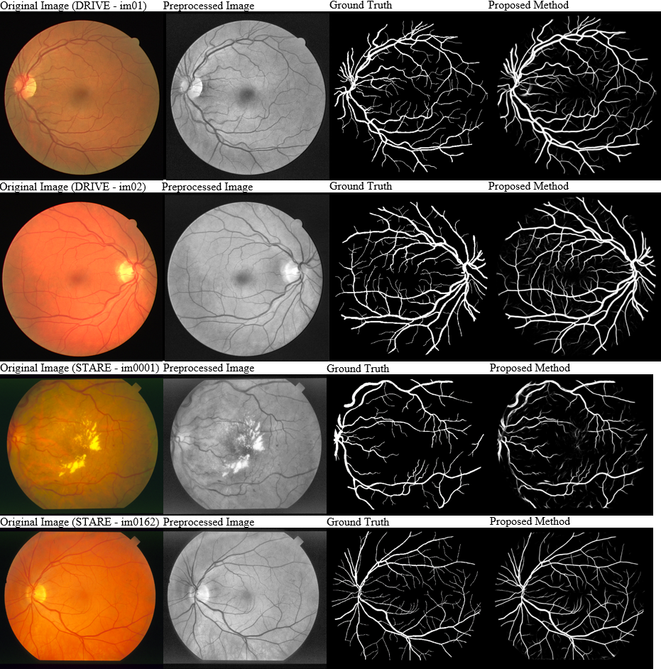

# UNet-Based Models of Blood Vessel Segmentation

This respository contains several U-Net based models for the purpose of segmenting blood vessels in retinal images.

### Datasets:
- [DRIVE](https://www.isi.uu.nl/Research/Databases/DRIVE/)
- [STARE](http://cecas.clemson.edu/~ahoover/stare/)

### Dependencies:
Baseline, SDCNN
- Keras

PDCN
- Keras 2.1.1
- Tensorflow

Attention
- Pytorch